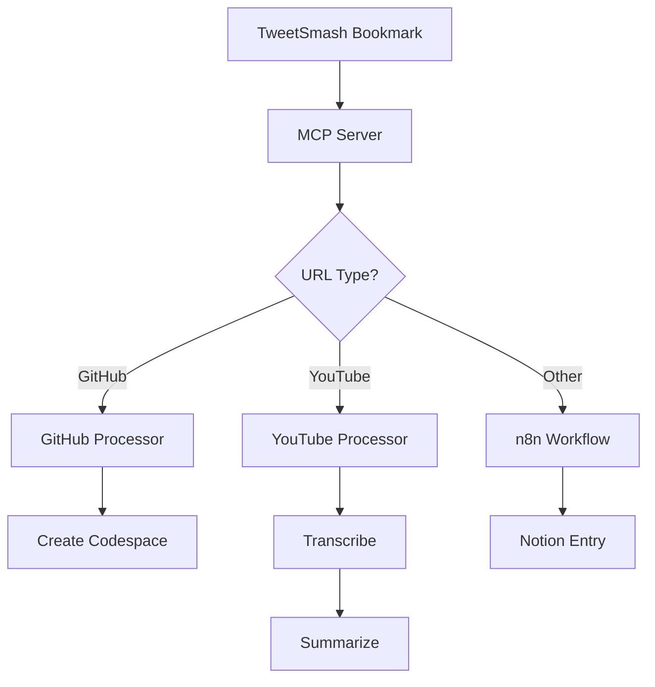

# TweetSmash Automation Pipeline Architecture

## System Overview

This system automates the processing of Twitter bookmarks from TweetSmash, routing content to appropriate services based on URL type.

## Architecture Components

### 1. MCP Server (`tweetsmash-mcp-server/`)
The Model Context Protocol server provides AI-accessible tools for interacting with TweetSmash and orchestrating the automation pipeline.

#### Core Tools:
- **fetch_bookmarks**: Retrieve bookmarks from TweetSmash API
- **process_bookmark**: Route bookmark to appropriate handler
- **webhook_handler**: Receive real-time bookmark notifications
- **get_processing_status**: Check status of bookmark processing

### 2. Content Processors

#### GitHub Processor
- Detects GitHub repository URLs
- Creates Codespaces via GitHub API
- Stores codespace URLs for quick access

#### YouTube Processor
- Identifies YouTube video URLs
- Transcribes video using Whisper API
- Summarizes content using LLM
- Saves summaries to designated storage

#### General Content Processor
- Handles all other URLs (articles, blogs, tweets)
- Forwards to n8n for Notion integration
- Maintains metadata and categorization

### 3. n8n Workflows

#### Main Workflow
1. **Webhook Trigger**: Receives bookmark data
2. **URL Parser**: Extracts and analyzes URLs
3. **Router Node**: Directs to appropriate sub-workflow
4. **Error Handler**: Manages failures and retries

#### Sub-Workflows
- **GitHub Workflow**: Codespace creation
- **YouTube Workflow**: Transcription + summarization
- **Notion Workflow**: Database entry creation

### 4. Docker Stack

```yaml
services:
  n8n:
    - Port: 5678
    - Persistent volume for workflows
    
  mcp-server:
    - Port: 3000
    - Environment variables for API keys
    
  postgres:
    - Database for n8n
    - Port: 5432
```

## Data Flow



## API Integrations

### Required API Keys
1. **TweetSmash API**: Bearer token authentication
2. **GitHub API**: Personal access token with codespace permissions
3. **OpenAI API**: For Whisper transcription and GPT summarization
4. **Notion API**: Integration token for database access
5. **YouTube Data API**: (Optional) For video metadata

### Rate Limits
- TweetSmash: 100 requests/hour
- GitHub: 5000 requests/hour (authenticated)
- OpenAI: Varies by tier
- Notion: 3 requests/second

## Security Considerations

1. **API Key Management**
   - Store in environment variables
   - Use Docker secrets for production
   - Rotate keys regularly

2. **Data Privacy**
   - No persistent storage of sensitive content
   - Encrypted connections for all API calls
   - Minimal logging of personal data

3. **Access Control**
   - MCP server authentication
   - n8n user management
   - Network isolation via Docker

## Deployment Strategy

### Local Development
```bash
docker-compose up -d
npm run dev:mcp-server
```

### Production
- Use managed n8n instance or self-host with SSL
- Deploy MCP server to cloud provider
- Set up monitoring and alerting
- Configure backup strategies

## Performance Optimization

1. **Caching**
   - Cache TweetSmash bookmark fetches (5 min TTL)
   - Store processed URL mappings
   - Cache GitHub repo metadata

2. **Batch Processing**
   - Group similar content types
   - Bulk API calls where possible
   - Queue management for rate limiting

3. **Async Processing**
   - Non-blocking bookmark processing
   - Background job queue for heavy tasks
   - Webhook acknowledgment before processing

## Monitoring & Logging

### Metrics to Track
- Bookmarks processed per hour
- Success/failure rates by content type
- API rate limit usage
- Processing time per bookmark

### Logging Strategy
- Structured JSON logs
- Log levels: ERROR, WARN, INFO, DEBUG
- Centralized log aggregation
- Retention policy: 30 days

## Error Handling

### Retry Strategy
- Exponential backoff for API failures
- Max 3 retries with increasing delays
- Dead letter queue for persistent failures
- Manual review queue in n8n

### Fallback Mechanisms
- If GitHub Codespace fails → Save repo link to Notion
- If YouTube transcription fails → Save video link with metadata
- If Notion fails → Local JSON backup

## Future Enhancements

1. **Machine Learning**
   - Auto-categorization of content
   - Personalized summarization styles
   - Duplicate detection

2. **Additional Integrations**
   - Obsidian vault sync
   - Readwise integration
   - Browser extension

3. **Analytics Dashboard**
   - Processing statistics
   - Content trends
   - API usage visualization