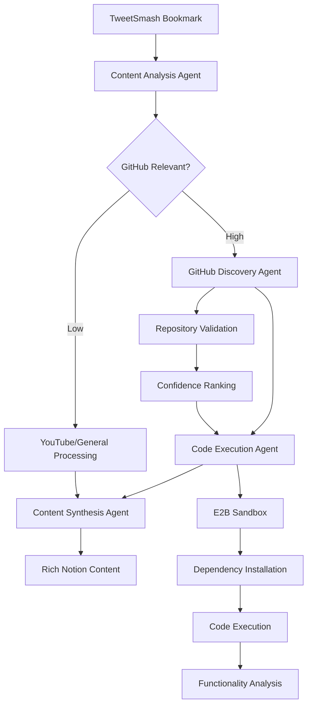

# TweetSmash Multi-Agent Automation Pipeline

An intelligent automation system that processes Twitter bookmarks from TweetSmash using a sophisticated multi-agent pipeline. Instead of just saving tweets, this system discovers and executes the actual GitHub repositories mentioned in tweets, providing deep code analysis and actionable insights.

## Problem Statement and Solution

**The Problem**: Traditional bookmark systems save tweets about code but fail to provide analysis of the actual code being discussed.

**The Solution**: A four-agent pipeline that:
1. Analyzes tweet content to identify GitHub references, including implicit ones
2. Discovers actual repositories from mentions, usernames, and contextual clues
3. Executes the code in secure E2B sandboxes to understand functionality
4. Synthesizes all findings into rich, actionable content for Notion storage

## Multi-Agent Architecture

### Agent 1: Content Analysis Agent
**Purpose**: Analyzes tweet text to identify GitHub references and programming content

**Capabilities**:
- Extracts direct GitHub URLs from tweet text
- Identifies GitHub usernames and repository mentions (`@user/repo` patterns)
- Detects programming keywords and technologies
- Calculates GitHub relevance score (0-1)
- Uses LLM to classify content type (project_announcement, tutorial, etc.)
- Infers author's GitHub username from context

**Example Input**: *"Just released my new Python CLI tool for developers!"*
**Output**: `github_relevance_score: 0.8, content_type: "project_announcement", author_github_candidate: "dev_user"`

### Agent 2: GitHub Discovery Agent  
**Purpose**: Discovers actual GitHub repositories from content analysis

**Capabilities**:
- Validates direct GitHub URLs and extracts repository metadata
- Searches for mentioned repositories via GitHub API
- Discovers author's repositories and ranks by relevance
- Uses LLM to infer potential repositories from context
- Ranks all discoveries by confidence score and activity

**Example Process**:
- Input: Author "johndoe" mentioned "CLI tool" and "Python"
- Action: Search `johndoe`'s repositories for recent Python CLI projects
- Output: `[{name: "awesome-cli", confidence: 0.9, language: "Python"}]`

### Agent 3: Code Execution Agent (E2B)
**Purpose**: Executes discovered repositories in secure sandboxes

**Capabilities**:
- Clones repositories in E2B sandboxes
- Auto-detects project type (Python, Node.js, Go, Rust, etc.)
- Automatically installs dependencies (`pip install`, `npm install`, etc.)
- Executes main files and captures output
- Analyzes functionality using LLM
- Extracts key insights and learning opportunities

**Example Process**:
1. Clone `github.com/user/awesome-cli`
2. Detect Python project with `requirements.txt`
3. Run `pip install -r requirements.txt`
4. Execute `python main.py --help`
5. Analyze output to understand CLI functionality

### Agent 4: Content Synthesis Agent
**Purpose**: Synthesizes all results into rich, actionable content

**Capabilities**:
- Combines tweet context with code execution results
- Generates comprehensive summaries in multiple styles
- Creates actionable items and learning opportunities
- Produces intelligent tags for categorization
- Formats content for Notion storage

**Example Output**:
```
Title: "Project Announcement by John Doe: Awesome CLI"
Content: "John Doe announced a Python CLI tool that provides developer utilities. 
Code analysis reveals it's a Click-based application with rich terminal output..."
Actionable Items: ["Explore awesome-cli - functional CLI tool", "Learn more about Click framework"]
Tags: ["python", "cli", "project_announcement", "executable", "high_quality"]
```

### Agent Orchestrator
**Purpose**: Coordinates the entire pipeline with intelligent routing

**Features**:
- Manages agent sequencing and error handling
- Provides multiple processing paths based on content type
- Implements timeouts and graceful degradation
- Tracks performance metrics and timing
- Handles fallback strategies when agents fail

## Configuration

Your `.env` file is configured with:
- **TweetSmash API key**: `WuHnPmLW6mhUDJWB4yTlLUpm`
- **OpenAI API key**: For LLM analysis and transcription
- **E2B API key**: `e2b_3d6e7a4cbb3f11b2b3b589d219318a8063f43461`
- **Anthropic API key**: For advanced reasoning

**Optional but recommended**:
- **Notion token**: For rich content storage
- **YouTube API key**: For video metadata (uses auto-captions by default)

## Quick Start & Testing Guide

### Step 1: Install Dependencies
```bash
pip install -r requirements.txt
```

### Step 2: Test System Configuration
```bash
python test_system.py
```

**What this tests**:
- API key validation
- TweetSmash API connectivity  
- URL routing logic
- Redis connection (optional)

**Expected Output**:
```
TweetSmash API working - Found X bookmarks
https://github.com/user/repo -> github
https://youtube.com/watch?v=123 -> youtube
All critical tests passed! System is ready.
```

### Step 3: Test Multi-Agent Pipeline
```bash
python test_pipeline.py
```

**What this tests**:
- Content Analysis Agent with sample tweets
- GitHub Discovery Agent with repository search
- Code Execution Agent with E2B sandboxes
- Content Synthesis Agent with rich output
- Full pipeline orchestration

**Sample Test Cases**:
1. **GitHub project announcement**: "Just released my new Python CLI tool!"
2. **Code tutorial reference**: "Great tutorial on FastAPI. The author's repository has examples."
3. **Library recommendation**: "Check out Plotly for data visualization!"
4. **Non-code content**: "Beautiful sunset today!"

**Expected Output**:
```
=== Testing Content Analysis ===
--- Testing: GitHub project announcement ---
Processing successful
   Title: Project Announcement by Dev User: Awesome CLI
   Tags: python, cli, project_announcement, executable
   GitHub repos found: 1
   Processing time: 12.5s
   Content preview: Dev User announced a Python CLI tool that provides...
```

### Step 4: Test Individual Agents
```bash
python -c "
import asyncio
from agents.content_analysis_agent import ContentAnalysisAgent

async def test():
    agent = ContentAnalysisAgent()
    result = await agent.process({
        'tweet_text': 'Check out my awesome Python project on GitHub!',
        'author_details': {'username': 'developer', 'name': 'John Dev'}
    })
    print(result)

asyncio.run(test())
"
```

### Step 5: Start Services
```bash
# Start infrastructure
docker-compose up -d

# Start MCP server
python mcp-server/server.py
```

**Verify services**:
- Redis: `redis-cli ping` → `PONG`
- PostgreSQL: Check docker logs
- n8n: http://localhost:5678
- MCP Server: Should show "TweetSmash MCP Server starting..."

### Step 6: Test MCP Tools
Using any Claude client that supports MCP:
```javascript
// Test pipeline status
await use_mcp_tool("get_pipeline_status", {})

// Test with sample data  
await use_mcp_tool("test_pipeline", {})

// Process a real bookmark
await use_mcp_tool("process_bookmark_intelligent", {
    bookmark_id: "your_bookmark_id",
    pipeline_config: {
        discovery_strategy: "aggressive",
        execution_strategy: "quick", 
        synthesis_style: "detailed"
    }
})
```

## Available MCP Tools

### Core Pipeline Tools
- **`process_bookmark_intelligent`**: Main multi-agent processing
- **`get_pipeline_status`**: Check agent health and configuration
- **`test_pipeline`**: Test with sample data

### Individual Component Tools  
- **`fetch_bookmarks`**: Get recent TweetSmash bookmarks
- **`analyze_url`**: Content type identification
- **`execute_github_repo`**: E2B repository execution
- **`execute_code_snippet`**: Run code snippets in sandbox
- **`transcribe_youtube`**: Video transcription and summarization
- **`save_to_notion`**: Rich content storage

### Utility Tools
- **`get_processing_status`**: Job tracking and monitoring

## Enhanced Workflow



## Testing Results You Should See

### Content Analysis Success
```json
{
  "success": true,
  "data": {
    "github_relevance_score": 0.85,
    "content_type": "project_announcement", 
    "direct_github_urls": ["https://github.com/user/awesome-tool"],
    "github_mentions": [{"type": "repository", "full_name": "user/awesome-tool"}],
    "code_keywords": ["python", "cli", "tool"],
    "requires_github_discovery": false,
    "processing_priority": "high"
  }
}
```

### GitHub Discovery Success
```json
{
  "success": true,
  "data": {
    "discovered_repositories": [
      {
        "name": "awesome-tool",
        "full_name": "user/awesome-tool",
        "confidence_score": 0.9,
        "discovery_method": "direct_validation",
        "language": "Python",
        "stars": 127,
        "is_active": true
      }
    ],
    "total_found": 1,
    "has_high_confidence_repos": true
  }
}
```

### Code Execution Success
```json
{
  "success": true,
  "data": {
    "execution_results": [
      {
        "success": true,
        "analysis": {"project_type": "python", "dependencies": ["click", "rich"]},
        "install_output": "Successfully installed click-8.1.0 rich-13.7.0",
        "run_output": "Usage: awesome-tool [OPTIONS] COMMAND [ARGS]...",
        "functionality": {
          "primary_function": "Developer CLI utility with rich output",
          "category": "cli_tool",
          "complexity_level": "intermediate"
        }
      }
    ],
    "successful_executions": 1,
    "has_runnable_code": true
  }
}
```

## Real-World Example

**Input Bookmark**: 
```
Tweet: "Just open-sourced my Python web scraper! Uses requests and BeautifulSoup for parsing HTML. Perfect for data collection projects. github.com/datascientist/web-scraper"
Author: @data_scientist
```

**Pipeline Processing**:

1. **Content Analysis** → Detects: Python project, web scraping, high GitHub relevance
2. **GitHub Discovery** → Validates: `datascientist/web-scraper`, active repo, 45 stars
3. **Code Execution** → Clones, installs dependencies, runs examples
4. **Synthesis** → Creates rich content:

**Final Output**:
```
Title: "Project Announcement by Data Scientist: Web Scraper"

Content: "Data Scientist announced a Python web scraping tool that combines requests and BeautifulSoup for HTML parsing. Code execution reveals a well-structured CLI application with example scripts for common scraping tasks. The tool includes rate limiting, error handling, and CSV export functionality, making it suitable for data collection projects."

Actionable Items:
- Explore web-scraper - functional scraping tool  
- Learn more about BeautifulSoup parsing techniques
- Compare implementation patterns for rate limiting
- Follow @data_scientist for more data collection content

Tags: ["python", "web-scraping", "requests", "beautifulsoup", "cli_tool", "data-collection", "project_announcement", "executable", "high_quality"]
```

## Pipeline Configuration Options

### Discovery Strategy
- **`aggressive`**: Searches broadly, uses LLM inference, more discoveries
- **`conservative`**: Only high-confidence matches, faster processing

### Execution Strategy  
- **`quick`**: Execute 1-2 simple repositories, faster results
- **`thorough`**: Execute up to 5 repositories, deeper analysis

### Synthesis Style
- **`detailed`**: Comprehensive 3-4 paragraph analysis
- **`summary`**: Concise 1-2 paragraph overview
- **`actionable`**: Bullet points and next steps focus

## Docker Services

- **redis**: Caching and job queue (port 6379)
- **postgres**: n8n database (port 5432)  
- **n8n**: Workflow automation (port 5678)
- **mcp-server**: MCP server with agents
- **webhook-server**: FastAPI webhook receiver (port 8000)
- **celery-worker**: Background job processor

## Performance & Monitoring

### Timing Expectations
- **Content Analysis**: 2-5 seconds
- **GitHub Discovery**: 5-10 seconds (with API calls)
- **Code Execution**: 10-30 seconds (depends on project complexity)
- **Content Synthesis**: 3-8 seconds
- **Total Pipeline**: 20-60 seconds average

### Health Monitoring
```bash
# Check pipeline status
python -c "
import asyncio
from agents.orchestrator import AgentOrchestrator
async def check(): 
    o = AgentOrchestrator()
    print(await o.get_pipeline_status())
asyncio.run(check())
"
```

## Troubleshooting

### Agent Issues
```bash
# Test individual agents
python test_pipeline.py  # Run agent tests

# Check LLM connectivity
python -c "import openai; print('OpenAI key valid')"

# Verify E2B connection  
python -c "from e2b import Sandbox; print('E2B available')"
```

### Common Issues
- **"Content analysis failed"**: Check Anthropic/OpenAI API keys
- **"GitHub discovery failed"**: Rate limits or network issues
- **"Code execution failed"**: E2B API key or sandbox issues
- **"Synthesis failed"**: LLM API quota or connectivity

### Performance Issues
- Use `conservative` discovery for faster processing
- Reduce `max_repositories` to 1-2 for speed
- Check Docker resource allocation for n8n/redis

## Advanced Project Structure

```
TweetSmash/
├── mcp-server/           # MCP server implementation  
│   ├── agents/          # 🤖 Multi-agent pipeline
│   │   ├── content_analysis_agent.py
│   │   ├── github_discovery_agent.py  
│   │   ├── code_execution_agent.py
│   │   ├── content_synthesis_agent.py
│   │   └── orchestrator.py
│   ├── tools/           # MCP tool implementations
│   │   ├── tweetsmash.py
│   │   ├── e2b.py       # E2B integration
│   │   ├── youtube.py
│   │   └── notion.py
│   ├── processors/      # Content processing logic
│   ├── services/        # External API clients  
│   └── utils/           # Configuration and utilities
├── test_pipeline.py     # 🧪 Multi-agent testing
├── test_system.py       # 🔧 System validation
├── n8n-workflows/       # n8n workflow templates
├── docker/              # Docker configuration
└── docs/                # Documentation
```

## Success Metrics

After running `test_pipeline.py`, you should see:
- **4/4 agents** functioning correctly
- **GitHub repositories** discovered and executed
- **Rich content** generated with actionable insights
- **Sub-60 second** processing times
- **High confidence** repository matches

This system transforms TweetSmash bookmarks from simple tweet saves into deep code analysis and learning opportunities, providing comprehensive understanding of the actual code being discussed in tweets.